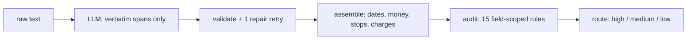

# ratecon

Extracts a validated, typed load record from the raw text of a freight rate confirmation, with a
per-field confidence signal and explicit routing to human review.

> The model selects spans. Python does interpretation, arithmetic, normalisation, and trust.

The model is never asked for a date, a number, or a field called `line_haul_rate`. It returns
verbatim substrings, so it cannot silently resolve `3/4/26`, decide that a charge labelled "Carrier
Charge" is a fuel surcharge, or overwrite a printed total. Those decisions are made in plain Python
that can be printed, unit-tested and changed without touching a prompt. What the model *does* still
decide is listed in [docs/design-notes.md](docs/design-notes.md#what-the-model-still-owns) — a short
list, but the most expensive error in the system is on it.

| Deliverable | Where |
|---|---|
| **Part 1** — the pipeline | `src/ratecon/`, run it with `uv run ratecon demo` |
| **Part 1.3** — *when to auto-populate vs. flag for review* | [below](#when-a-load-auto-populates-and-when-it-goes-to-a-human) |
| **Part 1.4** — missing fields, conflicting totals, ambiguous dates | fixtures 08, 05, 04 in the transcript below |
| **Part 2** — evaluation and reliability | [`docs/part2-evaluation.md`](docs/part2-evaluation.md) |
| **Part 3** — Carrier Match design | [`docs/part3-carrier-match.md`](docs/part3-carrier-match.md) |
| Why the code is shaped this way | [`docs/design-notes.md`](docs/design-notes.md) |

## Quickstart

```bash
uv sync
uv run ratecon demo                  # every fixture, offline, no API key
uv run pytest                        # 206 tests, all offline
uv run ratecon --log run.jsonl demo  # one JSON envelope per document, for monitoring
```

```
01_clean_single_pickup         high    Cleveland -> Charlotte  2026-03-16  total=2150.00
                               findings: none  [response: provider]
02_multi_stop_unmapped_charge  medium  Houston -> Seattle  2026-03-17  total=3900.00  confirm: commodity, destination, origin, pickup_date, total_rate, weight_lbs
                               findings: MULTI_COMMODITY, MULTI_STOP, ORIGIN_DATE_DISAGREEMENT, UNMAPPED_CHARGE  [response: provider]
03_clean_reefer                high    Salinas -> Denver  2026-03-19  total=2875.00
                               findings: none  [response: provider]
04_ambiguous_date              low     Allentown -> Newark  2026-03-04  total=1480.00  confirm: delivery_date, pickup_date
                               findings: DATE_UNRESOLVED  [response: provider]
05_unexplained_residual        medium  Green Bay -> Kansas City  2026-03-23  total=1900.00  confirm: fuel_surcharge, line_haul_rate, total_rate
                               findings: CHARGES_DONT_RECONCILE  [response: provider]
06_fuel_surcharge_reconciles   high    San Antonio -> Metairie  2026-03-24  total=1800.00
                               findings: none  [response: provider]
07_bill_of_lading              low     Cleveland -> Charlotte  2026-03-16  total=None  confirm: delivery_date, destination, origin, pickup_date, total_rate
                               findings: NOT_A_RATE_CON  [response: provider]
08_missing_total_and_delivery_date low     Davenport -> Sioux Falls  2026-03-27  total=None  confirm: delivery_date, total_rate, weight_lbs
                               findings: CRITICAL_FIELD_UNUSABLE, DATE_UNPARSEABLE, WEIGHT_IMPLAUSIBLE  [response: provider]
09_customer_rate_step_deck     low     Pittsburgh -> Omaha  2026-03-29  total=2150.00  confirm: equipment_type, total_rate
                               findings: EQUIPMENT_UNMAPPED, MULTIPLE_TOTALS  [response: provider]
10_transposed_dates            low     Dayton -> Lexington  2026-03-30  total=1325.00  confirm: delivery_date, pickup_date
                               findings: DATE_ORDER_INVALID  [response: provider]
11_model_misreads_the_lane     low     Greenville -> Baltimore  2026-04-14  total=2780.00  confirm: delivery_date, destination, load_id, origin, pickup_date
                               findings: NOT_GROUNDED, ORIGIN_DATE_DISAGREEMENT, STOP_COUNT_MISMATCH  [response: authored]
```

`[response: provider]` means that row is a **real recorded response** from `openai/gpt-5.6-luna`,
replayed from the committed cache — not something I wrote. Row 11 is the one exception, and is
deliberately wrong; see [On the offline cache](docs/design-notes.md#on-the-offline-cache).

Row 07 is worth a second look: a rejected document still publishes a lane and a pickup date with
every gating field marked `blocked`. That is deliberate — see *do not refuse to create the load* in
the Part 2 write-up.

## The published record

`ratecon extract`, on fixture 02 (`meta` elided):

```json
{
  "data": {
    "load_id": "ML-884390",
    "origin":      { "city": "Houston", "state": "TX", "zip": null },
    "destination": { "city": "Seattle", "state": "WA", "zip": null },
    "pickup_date": "2026-03-17", "delivery_date": "2026-03-25",
    "equipment_type": "flatbed",
    "line_haul_rate": 3400.0, "fuel_surcharge": null, "total_rate": 3900.0,
    "weight_lbs": 21000.0, "commodity": "Steel Coil",
    "confidence": "medium"
  },
  "field_status": {
    "load_id": "ok", "origin": "flagged", "destination": "flagged",
    "pickup_date": "flagged", "delivery_date": "ok", "equipment_type": "ok",
    "line_haul_rate": "ok", "fuel_surcharge": "ok", "total_rate": "flagged",
    "weight_lbs": "flagged", "commodity": "flagged"
  },
  "findings": [
    { "code": "UNMAPPED_CHARGE", "severity": "flag", "fields": ["total_rate"],
      "message": "Unclassified charge line(s): Carrier Charge 500.00. Not mapped to fuel — no fuel label present." },
    { "code": "MULTI_STOP", "severity": "flag", "fields": ["origin", "destination"],
      "message": "3 stops collapsed into one origin/destination pair." },
    { "code": "MULTI_COMMODITY", "severity": "flag", "fields": ["commodity", "weight_lbs"],
      "message": "2 distinct commodities printed; published the first ('Steel Coil') and its weight only." },
    { "code": "ORIGIN_DATE_DISAGREEMENT", "severity": "flag", "fields": ["pickup_date"],
      "message": "Header pickup date 2026-03-20 belongs to a different stop; published 2026-03-17 from the first pickup." }
  ],
  "confidence": "medium", "status": "ok"
}
```

`fuel_surcharge` is `null` and $500 sits outside the three-slot schema, because the document says
"Carrier Charge", which is not a fuel line. The arithmetic still closes, so the total is trustworthy
and this is advisory rather than fatal. `field_status` names every published field including the
clean ones — a consumer has to tell "checked, fine" from "no rule looked".

## On the three provided samples

`evals/provided/` holds the three rate confirmations supplied with the exercise, converted to text
with `pdftotext -layout` — not byte-identical to what `pdf.py` emits, but the same kind of artefact:
layout-preserved text with the table columns still interleaved.

```bash
uv run ratecon extract evals/provided/sampleB_LD64408.txt --offline
```

`tests/test_provided_samples.py` runs all three on every CI run and asserts the published values
against **what `openai/gpt-5.6-luna` actually returned** — recorded responses, replayed offline. The
test refuses to pass on an authored one.

| | lane | pickup | delivery | total | conf | findings |
|---|---|---|---|---|---|---|
| **A** `LD64392` | Chicago IL → New York NY | 2026-07-30 | 2026-08-01 | 50.00 | high | `WEIGHT_IMPLAUSIBLE` |
| **B** `LD64408` | Miami FL → San Jose CA | 2026-07-28 | 2026-08-05 | 700.00 | medium | `MULTI_STOP`, `MULTI_COMMODITY`, `UNMAPPED_CHARGE`, `ORIGIN_DATE_DISAGREEMENT` |
| **C** `LD64407` | Chicago IL → New York NY | 2026-07-31 | 2026-08-02 | 50.00 | high | `WEIGHT_IMPLAUSIBLE` |

Four cells in that table are the design working:

- **A's delivery date.** `08/01/2026` cannot be read alone. The sibling `07/30/2026` has a 30, so
  the document is MDY, and only that inference makes it 1 August rather than 8 January. Four of the
  seven stop dates across the three samples are locally ambiguous.
- **B's lane and pickup date.** Two pickups, one drop. The lane is first-pickup to last-drop in
  printed order, and the pickup date is *that stop's own* — not the header's `03-Aug-2026`, which
  belongs to the Chicago pickup. Pairing Miami with 03-Aug dispatches a truck 1,200 miles wrong.
- **B's $200.** `Base Carrier Rate` is line haul; `Carrier Charge` is not. They share the token
  *Carrier*, and a substring match maps both to line haul, drives the residual to zero and scores
  the one interesting sample as clean.
- **`WEIGHT_IMPLAUSIBLE` on A and C** is correct, not noise: 182 lb and 422 lb on an FTL flatbed are
  artefacts of a test document. It lands on `weight_lbs`, which is not gating, so it says so without
  holding up the load.

The model was more faithful than my authored guess in two places, which is the argument for
recording rather than authoring. On sample B it returned all **four** commodity rows where I had
written two, and it returned `weight_text: "-"` because that is literally what the Weight column
prints — which surfaced a real bug: `WEIGHT_UNREADABLE` was firing on the document's own null
marker, treating a correct read as a refusal. On fixture 08 it returned
`"TBD - dispatch will advise"` verbatim where I had written `null`, so the finding is
`DATE_UNPARSEABLE` rather than `DATE_MISSING` — a better answer than mine, and the reason those two
codes are separate.

**Cost, measured rather than estimated:** 13 documents, 14,892 input and 3,522 output tokens,
**$0.0072** — about **$0.55 per 1,000 rate confirmations** at `gpt-5.6-luna` list price. That is the
number to put next to a broker's per-load margin, and it is small enough that model choice here is a
question about accuracy, not about spend.

## When a load auto-populates, and when it goes to a human

The brief asks the README for this specifically, so here is the whole answer in one line: **`high`
auto-populates, `medium` auto-populates but holds the money, `low` goes to the review queue.** No
tier refuses to create the load.

| tier | what the consumer does |
|---|---|
| **high** | Auto-populate the load. No human touches it. |
| **medium** | Auto-populate, mark the flagged fields, and **block the money event** — carrier tender and payment — until a reviewer confirms them. The load exists; only the payable is held. |
| **low** | Auto-populate, mark everything, and route the document to the review queue before anything downstream fires. |

Refusing to create the load on low confidence is the obvious design and it is wrong: a broker with a
truck waiting will key it manually, and the workflow is lost permanently. Holding the *money* rather
than the *record* buys the same protection at a fraction of the friction. That policy belongs to the
consuming system; this repo emits the tier and the per-field `field_status` that make it enforceable.
`docs/part2-evaluation.md` argues the case at length.

### How the tier is decided

Each finding names the field it impugns and is either **BLOCK** (that field is unusable) or **FLAG**
(usable, confirm it). Five fields gate: `total_rate`, `pickup_date`, `delivery_date`, `origin`,
`destination` — the ones that make a booking wrong in a way that costs money on the day.

```
BLOCK on a gating field      → low
BLOCK on a non-gating field  → medium
FLAG  on a gating field      → medium
otherwise                    → high
```

Three tiers because a consumer has exactly three behaviours. There are no counting thresholds to
defend — no "two majors make a minor" — because every rule has to justify itself by naming a field,
which is a better forcing function on rule design than a tally. **A BLOCK never erases the value**:
it marks the field and leaves the data in place, so a disagreement in one field cannot destroy
another field's good value.

**Why not a continuous score?** The right object is `P(field correct | finding set)`, fit by logistic
regression on the finding indicators using broker corrections as labels. I don't have those labels,
so I shipped the rules that make the decision and the `--log` output that would produce them.

**Why not model-derived confidence?** Anthropic exposes no logprobs, and on OpenRouter support is
per-endpoint. Under constrained decoding the distribution is renormalised over grammar-legal tokens,
so an enum reads ~0.99 because only four tokens were ever legal — that is the grammar's confidence,
not the model's, and it is weakest on the free-text spans that matter. Verbalised confidence is the
vibes the brief asks us not to ship, and self-consistency doesn't rescue it: models sharing
pretraining fail the *same way* on the same ambiguous span.

## How it works



| Module | Does |
|---|---|
| `schema.py` | `LlmExtraction` (wire) and `RateConfirmation` (the published contract), plus wire-schema shaping |
| `extract.py` | `LLMClient` protocol, OpenRouter client, cache, bounded repair retry, `FakeClient` |
| `normalize.py` | date resolver, `Decimal` money, stop selection, charge classifier, equipment map |
| `rules.py` | the 15 rules, each a pure function |
| `pipeline.py` | assembly, the routing ladder, the total-function boundary |

### Precision and recall are different checks

Most of `rules.py` asks *is this value printed on the document?* That is precision, and alone it is
not enough, because omission is invisible to it — and the asymmetry is vicious. Dropping a stop also
drops the findings that would have flagged the lane:

```
before STOP_COUNT_MISMATCH existed:
  FAITHFUL (3 stops)   medium  Houston -> Seattle      pickup=2026-03-17  MULTI_STOP, ORIGIN_DATE_DISAGREEMENT
  MODEL DROPS stop 1   high    Springfield -> Seattle  pickup=2026-03-20  (no findings)
```

Wrong origin, wrong date, top tier, nothing marked. `STOP_COUNT_MISMATCH` counts numbered stop rows
in the source and blocks when the model returned fewer, so the truncated reading now lands at `low`.

Every part of that counting is biased toward under-counting, and each bias was a false BLOCK on the
whole gating set before it was added: a leading row number is required, so the "Shipper
Instructions" heading is not a stop; lines carrying an amount are dropped, so
`2  Stop Off Charge  $100.00` is not a third stop; and it counts *distinct* row numbers, so a TMS
numbering stops 10/20/30 is a scheme rather than thirty stops. The bias is deliberate — a missed
omission costs one undetected error, a false BLOCK costs a human review on every clean document of
that template — and it means an unnumbered layout still lets a dropped stop through.

## Where the reasoning lives

`docs/design-notes.md` is the argument for every choice above — the date policy, the charge
classifier, what the model still owns, the limits of grounding and of the injection defence, and
what I deliberately did not build. `docs/part2-evaluation.md` covers evaluation and production
monitoring; `docs/part3-carrier-match.md` is the Carrier Match design.

## Notes on the stack

Python 3.12+, `uv`, Pydantic v2, `ruff` (replacing black and isort), `mypy --strict`, `pytest`.
OpenRouter via the `openai` SDK's `base_url`, pinned to `openai/gpt-5.6-luna`. `pdfplumber` rather than PyMuPDF, which is AGPL-3.0
and auto-flagged by many corporate OSS policies. Tool calling is the only schema path, and every
response is validated regardless — `docs/design-notes.md` says why.

### Deviations from the brief's schema

- `origin` / `destination` are `Address | null`. The brief marks `zip` nullable but not the object,
  and types `city` and `state` as non-null — and a document with no usable pickup has no honest
  value for them. `{"city": "", "state": ""}` is worse than `null`, because an empty string reads
  downstream as a real address.
- Money is `Decimal` internally, serialised as a JSON number because the brief says `number`. A
  string would be safer against float round-tripping; the brief wins, and it is flagged rather than
  silently improved.
- Everything else is the brief's contract exactly, asserted field-by-field in
  `test_the_published_contract_is_asserted_value_by_value`.
